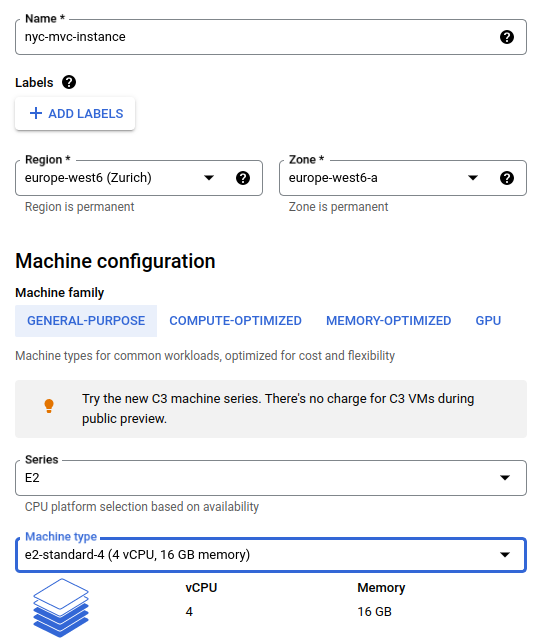
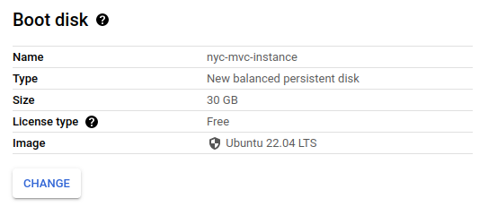

## Setting up a Virtual Machine (VM)

**Step 1:** generate ssh key.
```
ssh-keygen -t rsa -f ~/.ssh/gcp -C nyc-user -b 2048
```

**Step 2:** copy the content of ~/.ssh/gcp.pub and upload it to GCP: "Compute Engine -> Settings -> Metadata -> SSH Keys -> Add SSH Key".

**Step 3:** enable the Compute Engine API.

**Step 4:** create a VM instance through GCP UI.





Or running the equivalent command line.
```
gcloud compute instances create nyc-mvc-instance \
    --project=leafy-momentum-381114 \
    --zone=europe-west6-a \
    --machine-type=e2-standard-4 \
    --network-interface=network-tier=PREMIUM,subnet=default \
    --maintenance-policy=MIGRATE \
    --provisioning-model=STANDARD \
    --service-account=719306988892-compute@developer.gserviceaccount.com \
    --scopes=https://www.googleapis.com/auth/devstorage.read_only,https://www.googleapis.com/auth/logging.write,https://www.googleapis.com/auth/monitoring.write,https://www.googleapis.com/auth/servicecontrol,https://www.googleapis.com/auth/service.management.readonly,https://www.googleapis.com/auth/trace.append \
    --create-disk=auto-delete=yes,boot=yes,device-name=nyc-mvc-instance,image=projects/ubuntu-os-cloud/global/images/ubuntu-2204-jammy-v20230302,mode=rw,size=30,type=projects/leafy-momentum-381114/zones/europe-west6-a/diskTypes/pd-balanced \
    --no-shielded-secure-boot \
    --shielded-vtpm \
    --shielded-integrity-monitoring \
    --labels=ec-src=vm_add-gcloud \
    --reservation-affinity=any
```

**Step 5:** ssh into the VM (here, you have to replace 34.65.220.26 with the VM's IP).
```
ssh -i ~/.ssh/gcp nyc-user@34.65.220.26
```

**Step 6:** install dependencies...