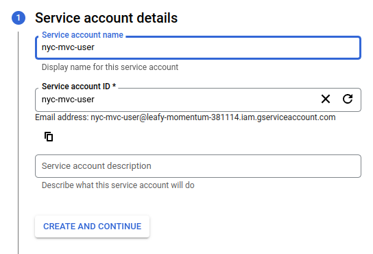
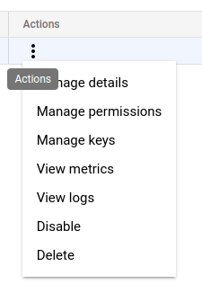
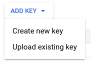

## 1 - GCP and Terraform

* [1.1 Setting up GCP](#11---setting-up-gcp)
* [1.2 Setting up Terraform](#12---setting-up-terraform)

## 1.1 - Setting up GCP

**Step 1:** create a GCP Project named nyc-motor-vehicle-collisions.

**Step 2:** create a GCP service account. For such, go to "IAM -> Service Accounts -> Create Service Account".




**Important note:** in this project we are granting "BigQuery Admin", "Storage Admin" and "Storage Object Admin" permissions to our service account. Note, however, that this is not recommended for real world scenarios. In such cases, we must follow the [principle of least privilege](https://cloud.google.com/blog/products/application-development/least-privilege-for-cloud-functions-using-cloud-iam).

**Step 3:** generate ssh keys for our service account, by clicking on the "Manage keys" option under "Actions" in the service accounts page. Then, click on "Add Key -> Create New Key -> JSON", download the key and save it in the project directory.






**Step 4:** export the GOOGLE_APPLICATION_CREDENTIALS variable (change the path below to the correct one in your machine).

```
export GOOGLE_APPLICATION_CREDENTIALS="$(pwd)/leafy-momentum-381114-c383fbc45666.json"

# Refresh token, and verify authentication
gcloud auth application-default login
```

## 1.2 - Setting up Terraform

**Step 1:** initialize terraform and install any required plugins and settings.
```
cd terraform
terraform init
```

**Step 2:** run planning, which outputs what Terraform is going to create or modify in our infrastructure (note that it will not apply anything, it just shows us what is going to be done if we decide to apply the changes). This command will ask us to inform the gcp project id variable (in my case, it is leafy-momentum-381114).
```
terraform plan
```

**Step 3:** apply the changes.
```
terraform apply
```

The output of the command above must be something like this:
```
google_bigquery_dataset.dataset: Creating...
google_storage_bucket.data-lake-bucket: Creating...
google_bigquery_dataset.dataset: Creation complete after 2s [id=projects/leafy-momentum-381114/datasets/nyc_mvc_data]
google_storage_bucket.data-lake-bucket: Creation complete after 3s [id=nyc_mvc_data_lake_leafy-momentum-381114]

Apply complete! Resources: 2 added, 0 changed, 0 destroyed.
```

We have just created our GCS Bucket and BigQuery Data Warehouse.