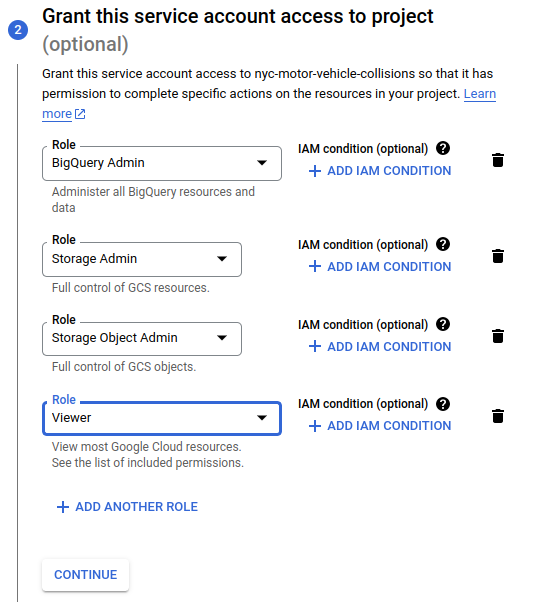
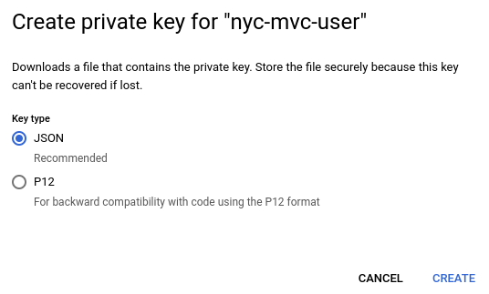
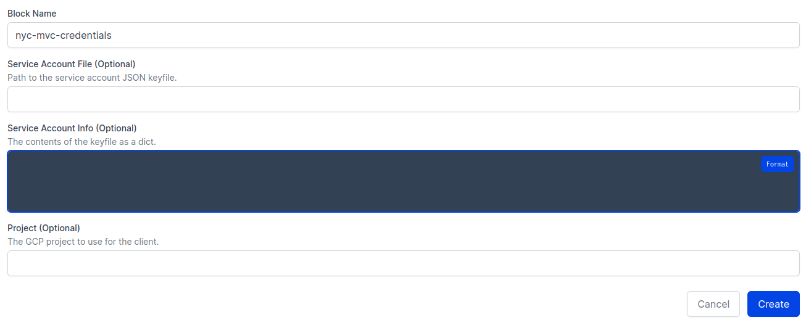
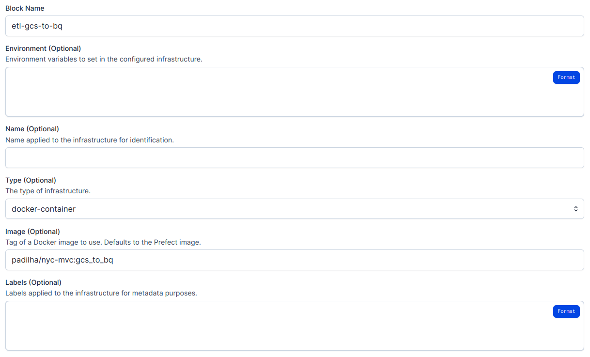

## Overview

1. [Local requirements](#1-local-requirements)
1. [Setting up GCP](#2-setting-up-gcp)
2. [Setting up Prefect workflows and Terraform infrastructure](#3-setting-up-prefect-workflows-and-terraform-infrastructure)
3. [Dbt project](#4-dbt-project)

## 1. Local requirements

* [gcloud CLI](https://cloud.google.com/sdk/docs/install)
* [docker](https://docs.docker.com/engine/install/ubuntu/)
* [miniconda](https://docs.conda.io/en/latest/miniconda.html)
* Create environment from yml file: `conda env create -f env.yml`

## 2. Setting up GCP

In this section, we are going to create a GCP project and a service accout.

1. Create a GCP Project named nyc-motor-vehicle-collisions.

2. Create a GCP service account. For such, go to "IAM -> Service Accounts -> Create Service Account".

    

    

    > **Note:** in this project we are granting "BigQuery Admin", "Storage Admin" and "Storage Object Admin" permissions to our service account. Note, however, that this is not recommended for real world scenarios. In such cases, we must follow the [principle of least privilege](https://cloud.google.com/blog/products/application-development/least-privilege-for-cloud-functions-using-cloud-iam).

3. Generate ssh keys for our service account, by clicking on the "Manage keys" option under "Actions" in the service accounts page. Then, click on "Add Key -> Create New Key -> JSON", download the key and save it in the project directory.

    

    

    

4. Export the `GOOGLE_APPLICATION_CREDENTIALS` variable (change the path below to the correct one in your machine).
    ```
    export GOOGLE_APPLICATION_CREDENTIALS="$(pwd)/.credentials/leafy-momentum-381114-c383fbc45666.json"

    # Refresh token, and verify authentication
    gcloud auth application-default login
    ```

5. Generate ssh key to access the Virtual Machine (VM) that will be created in the next section.
    ```
    ssh-keygen -t rsa -f ~/.ssh/gcp -C nyc-user -b 2048
    ```

6. Copy the content of ~/.ssh/gcp.pub and upload it to GCP: "Compute Engine -> Settings -> Metadata -> SSH Keys -> Add SSH Key". Later, the VM can be accessed using the following command (you have to replace 34.65.220.26 with the VM's IP).
    ```
    ssh -i ~/.ssh/gcp nyc-user@34.65.220.26
    ```

## 3. Setting up Prefect workflows and Terraform infrastructure

In this section we are going to create our GCP infrastructure using Terraform and deploy two Prefect workflows: the first one extracts data from the web and loads it into GCS and the second one pulls data from GCS and loads it into BigQuery.

1. Login to [Prefect Cloud](https://www.prefect.io/cloud/) and create a workspace named nyc-mvc. Then, go to [https://app.prefect.cloud/my/profile](https://app.prefect.cloud/my/profile) -> "API Keys" and create a new API key.

2. Create a private [DockerHub](https://hub.docker.com/) repository and login to DockerHub by running `docker login` in your local terminal.

3. Build Prefect flow images. Here, `padilha/nyc-mvc` must be replaced by the correct DockerHub `username/repository`. Note that we are uploading different images to the same repository using different tags. This may not be the best practice to adopt in a real application. However, we are going to push both images to the same repository in this project because DockerHub allows only one private repository per free account.
    ```
    docker image build --no-cache -t padilha/nyc-mvc:web_to_gcs ./workflows/web_to_gcs/
    docker image build --no-cache -t padilha/nyc-mvc:gcs_to_bq ./workflows/gcs_to_bq/
    docker push padilha/nyc-mvc:web_to_gcs
    docker push padilha/nyc-mvc:gcs_to_bq
    ```

4. Initialize terraform and install any required plugins and settings.
    ```
    cd terraform
    terraform init
    ```

5. Run planning, which outputs what Terraform is going to create or modify in our infrastructure (note that it will not apply anything, it just shows us what is going to be done if we decide to apply the changes).
    ```
    terraform plan \
        -var="project=<your-gcp-project-id>" \
        -var="prefect_api_key=<your-prefect-api-key>" \
        -var="prefect_workspace=<your-prefect-cloud-user/workspace-name>" \
        -var="dockerhub_user=<your-dockerhub-login>" \
        -var="dockerhub_passwd=<your-dockerhub-password>"
    ```

6. Apply the changes.
    ```
    terraform apply \
        -var="project=<your-gcp-project-id>" \
        -var="prefect_api_key=<your-prefect-api-key>" \
        -var="prefect_workspace=<your-prefect-cloud-user/workspace-name>" \
        -var="dockerhub_user=<your-dockerhub-login>" \
        -var="dockerhub_passwd=<your-dockerhub-password>"
    ```

    The output of the command above must be something like this:
    ```
    google_bigquery_dataset.dataset: Creating...
    google_storage_bucket.data-lake-bucket: Creating...
    google_compute_instance.default: Creating...
    google_bigquery_dataset.dataset: Creation complete after 1s [id=projects/leafy-momentum-381114/datasets/nyc_mvc_data]
    google_storage_bucket.data-lake-bucket: Creation complete after 3s [id=nyc_mvc_data_lake_leafy-momentum-381114]
    google_compute_instance.default: Still creating... [10s elapsed]
    google_compute_instance.default: Creation complete after 18s [id=projects/leafy-momentum-381114/zones/us-central1-a/instances/nyc-mvc-instance-terraform]

    Apply complete! Resources: 3 added, 0 changed, 0 destroyed.
    ```

    We have just created our GCS Bucket, BigQuery Data Warehouse and Virtual Machine to run our Prefect workflows.

    > **Note:** reboot VM because of prefect agent

7. Create a credentials block in Prefect Cloud (paste the content of the service account json file in "Service Account Info").

    

    

8. Create a GCS block in Prefect Cloud.

    

    

9. Create Docker container blocks in Prefect Cloud. In both blocks, set the ImagePullPolicy option to ALWAYS.

    

    

    

10. In your local machine, deploy the Prefect workflows.
    ```
    python workflows/docker_deploy.py
    ```

11. The etl-web-to-gcs workflow is going to run every day at 00:00 AM UTC and etl-gcs-to-bq is going to run every day at 01:00 AM UTC. However, if you want, you can now trigger two Quick Runs through Prefect Cloud to test them. Everything should work fine and you will see the following DAGs.

    

    

## 4. Dbt project

1. [Set up dbt cloud with BigQuery](https://github.com/DataTalksClub/data-engineering-zoomcamp/blob/main/week_4_analytics_engineering/dbt_cloud_setup.md). Use dbt_nyc_mvc as the directory for your project.

2. [Create a deployment job](https://github.com/padilha/de-zoomcamp/tree/master/week4#de-zoomcamp-441---deployment-using-dbt-cloud) that runs every day at 02:00 AM UTC.