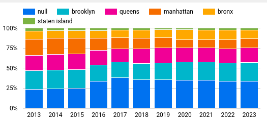
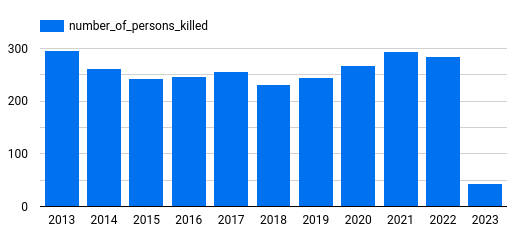
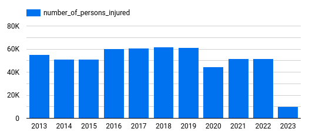
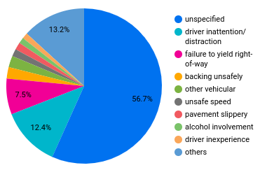

## NYC Motor Vehicle Collisions Project

This repository contains my final project for the [Data Engineering Zoomcamp by DataTalksClub](https://github.com/DataTalksClub/data-engineering-zoomcamp). I built a batch data pipeline that extracts, transforms and loads the [New York City Motor Vehicle Collisions](https://data.cityofnewyork.us/Public-Safety/Motor-Vehicle-Collisions-Crashes/h9gi-nx95) dataset into a Data Warehouse in the [Google Cloud Platform (GCP)](https://cloud.google.com/).

For my course notes and homework solutions, check my [DE Zoomcamp repository](https://github.com/padilha/de-zoomcamp). For the steps of how to reproduce this project, see [HOW-TO-RUN.md](./HOW-TO-RUN.md).

## Project description

According to the dataset description, there is a police report in New York City that must be filled out whenever an accident where a person is injured or killed or there are more than 1000 dollars worth of damage. The dataset contains accident records since july/2012 and is updated on a daily base. As of March 2023, it has around 1.98 million rows.

This project has the goal of answering the following questions:

1. What is the yearly percentage of accidents per borough since 2013?

2. How many people were killed per year since 2013?

3. How many people were injured per year since 2013?

4. What is the contributing factor distribution for accidents that involved a single vehicle since 2013?

## Project architecture and technologies used

The following technologies were used:

* [Pandas](https://pandas.pydata.org/) for fetching the dataset from the API endpoint.

* [Prefect](https://www.prefect.io/) and [Prefect Cloud](https://www.prefect.io/cloud/) for dataflow implementation and workflow orchestration.

* [Terraform](https://www.terraform.io/) for managing and provisioning infrastructure (GCS bucket, Data Warehouse and Virtual Machine) in GCP.

* [Docker](https://www.docker.com/) for encapsulating the dataflows and their dependencies into containers, making it easier to deploy them.

* [Data build tool (dbt)](https://www.getdbt.com/) for transforming the dataset in the data warehouse.

* [Google Lookerstudio](https://lookerstudio.google.com/) for creating dashboards to visualize the dataset.

## Results

1. What is the yearly percentage of accidents per borough since 2013?

2. How many people were killed per year since 2013?

3. How many people were injured per year since 2013?

4. What is the contributing factor distribution for accidents that involved a single vehicle since 2013?

