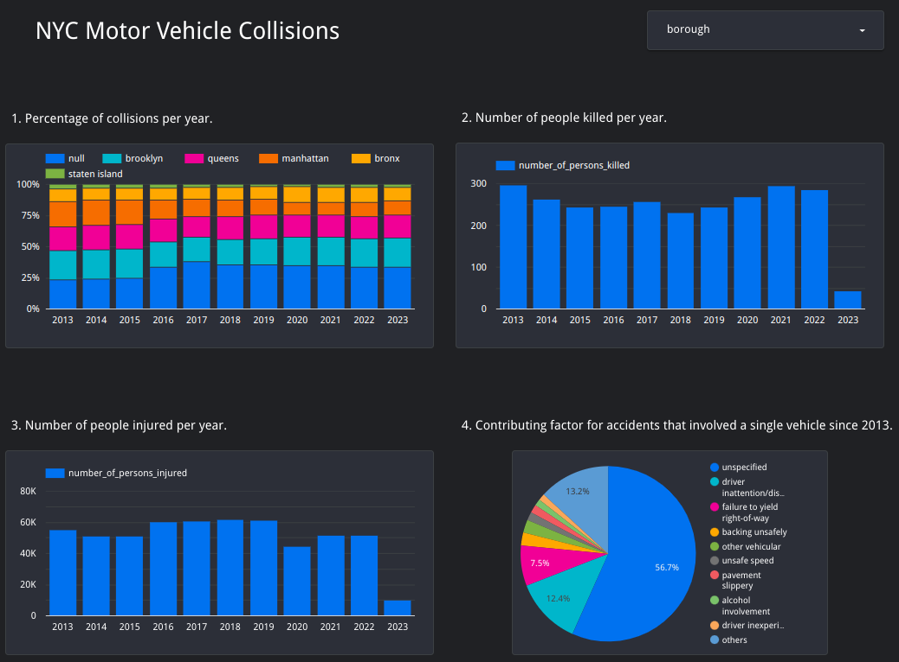

## NYC Motor Vehicle Collisions Project

This repository contains my final project for the [Data Engineering Zoomcamp by DataTalksClub](https://github.com/DataTalksClub/data-engineering-zoomcamp). I built a batch data pipeline that extracts, transforms and loads the [New York City Motor Vehicle Collisions](https://data.cityofnewyork.us/Public-Safety/Motor-Vehicle-Collisions-Crashes/h9gi-nx95) dataset into a Data Warehouse in the [Google Cloud Platform (GCP)](https://cloud.google.com/).

For my course notes and homework solutions, check my [DE Zoomcamp repository](https://github.com/padilha/de-zoomcamp). For the steps of how to reproduce this project, see [HOW-TO-RUN.md](./HOW-TO-RUN.md).

## Project description

According to the dataset description, there is a police report in New York City that must be filled out whenever an accident where a person is injured or killed or there are more than 1000 dollars worth of damage. The dataset contains accident records since july/2012 and is updated on a daily base. As of March 2023, it has around 1.98 million rows.

This project has the goal of answering the following questions:

1. What is the yearly percentage of accidents per borough since 2013?

2. How many people were killed per year since 2013?

3. How many people were injured per year since 2013?

4. What is the contributing factor distribution for accidents that involved a single vehicle since 2013?

## Project architecture

### How the data pipeline works

* Prefect dataflows:

    1. [ETL Web to GCS](./workflows/web_to_gcs/etl_web_to_gcs.py): fetches data from the NYC Open Data API (Extract), converts the ZIP CODE column to int to avoid mixed type exceptions and creates the CRASH DATETIME column by merging the CRASH DATE and CRASH TIME columns (Transform), and loads the data into GCS (Load).

    2. [ETL GCS to BigQuery](./workflows/gcs_to_bq/etl_gcs_to_bq.py): fetches data from GCS (Extract), transforms string columns by stripping leading and trailing whitespaces, replacing multiple spaces with a single space and bringing all column names to lowercase (Transform), and loads the data into BigQuery (Load).

* Dbt models:

    1. [stg_crashes](./dbt_nyc_mvc/models/staging/stg_crashes.sql): selects a subset of columns from the raw table that was loaded into BigQuery, filtering only records that happened after January 1st, 2013.

    2. [fact_crashes](./dbt_nyc_mvc/models/core/fact_crashes.sql): selects all data from stg_crashes, partitions it by year and clusters the records by borough and contributing_factor_vehicle_1. Here, the partitioning makes it more efficient to query data and extract statistics by year. With respect to clustering, borough and contributing_factor_vehicle_1 are the main categorical values whose distributions I was interested in seeing when building my dashboard.

### Technologies

* [Pandas](https://pandas.pydata.org/) for fetching the dataset from the API endpoint.

* [Prefect](https://www.prefect.io/) and [Prefect Cloud](https://www.prefect.io/cloud/) for dataflow implementation and workflow orchestration.

* [Terraform](https://www.terraform.io/) for managing and provisioning infrastructure (GCS bucket, Data Warehouse and Virtual Machine) in GCP.

* [Docker](https://www.docker.com/) for encapsulating the dataflows and their dependencies into containers, making it easier to deploy them.

* [Data build tool (dbt)](https://www.getdbt.com/) for transforming, partitioning and clustering the dataset in the data warehouse.

* [Google Lookerstudio](https://lookerstudio.google.com/) for creating a dashboard to visualize the dataset.

## Results

The dashboard is publicly available in this [link](https://lookerstudio.google.com/reporting/ef66bb46-2972-45fe-89ce-330662311974).

### Key findings

* The borough information is null for 32% of the records in each year, on average. One way to circumvent this limitation could be to use the [NYC Borough Boundaries data](https://data.cityofnewyork.us/City-Government/Borough-Boundaries/tqmj-j8zm) for checking where each accident happened based on the reported latitude and longitude pairs and using [Geopandas](https://geopandas.org/en/stable/index.html) to determine the respective borough.

* Considering only records that contain the borough information, brooklyn and queens account for more than 50% of the accidents.

* From 2013 to 2022, the minimum number of people killed in a single year was 231 (in 2018) while the maximum number was 297 (in 2013).

* From 2013 to 2022, the minimum number of people injured in a single year was 44,615 (in 2020) while the maximum number was 61,941 (in 2018).

* Besides "unspecified" (56.7%) and "others" (13.2%), the main contributing factor for accidents that involved a single vehicle since 2013 was "driver inattention/distraction" (12.4%).