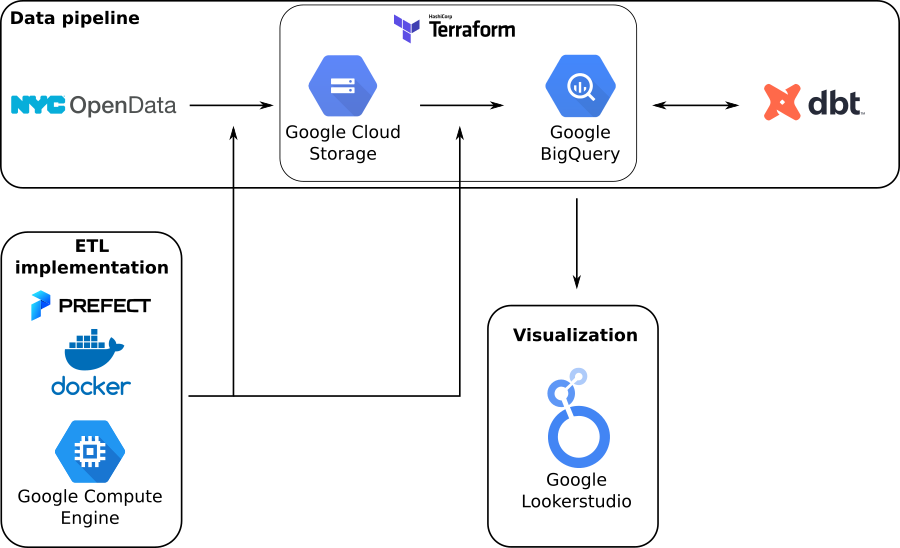

## NYC Motor Vehicle Collisions Project

This repository contains my final project for the [Data Engineering Zoomcamp by DataTalksClub](https://github.com/DataTalksClub/data-engineering-zoomcamp). I build a batch data pipeline that extracts the extracts, transforms and loads the [New York City Motor Vehicle Collisions](https://data.cityofnewyork.us/Public-Safety/Motor-Vehicle-Collisions-Crashes/h9gi-nx95) dataset into a Data Warehouse.

For my course notes and homework solutions, check my [DE Zoomcamp repository](https://github.com/padilha/de-zoomcamp). For the steps of how to reproduce this project, see [HOW-TO-RUN.md](./HOW-TO-RUN.md).

## Project description

According to the dataset description, there is a police report that must be filled out whenever an accident where a person is injured or killed or there are more than 1000 dollars worth of damage. The dataset contains accident records since july/2012 and is updated on a daily base. Currently (March 2023), it has around 1.98 million rows.

This project has the goal of answering the following questions:

1. What is the yearly percentage of accidents per borough since 2013?

2. How many people died per year since 2013?

3. How many people got injured per year since 2013?

4. What is the most common contributing factor for accidents that involved a single vehicle since 2013?

## Project architecture

## Requirements

* [gcloud CLI](https://cloud.google.com/sdk/docs/install)
* [docker](https://docs.docker.com/engine/install/ubuntu/)
* [miniconda](https://docs.conda.io/en/latest/miniconda.html)

